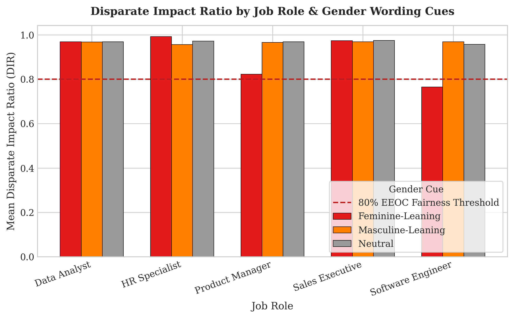
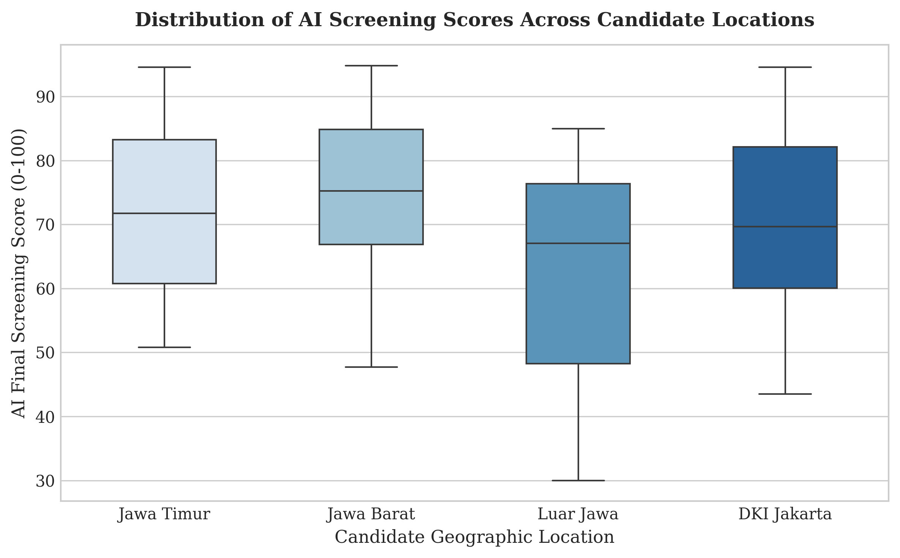
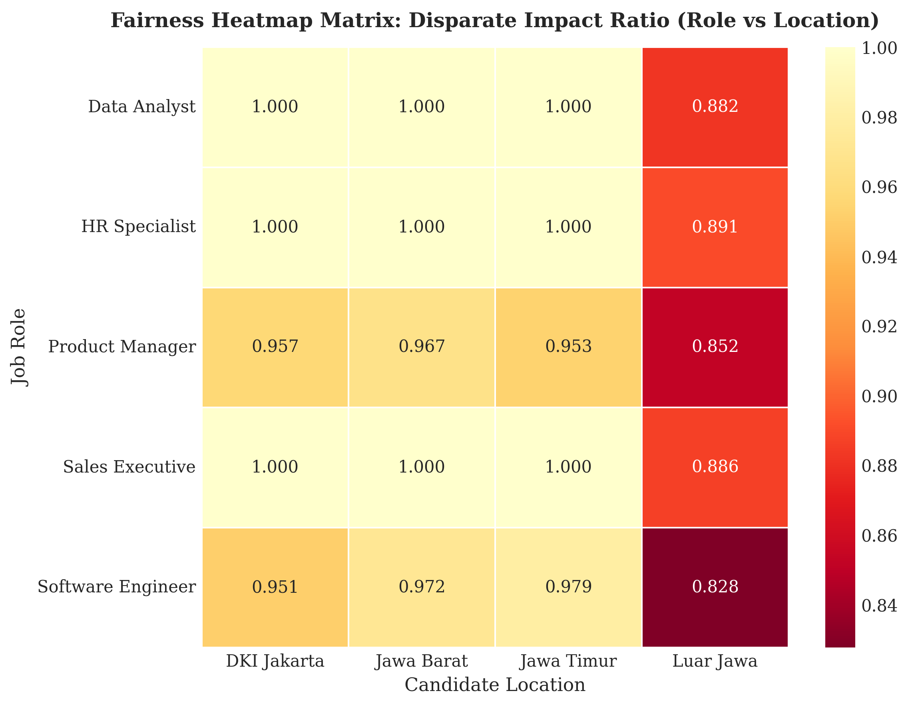
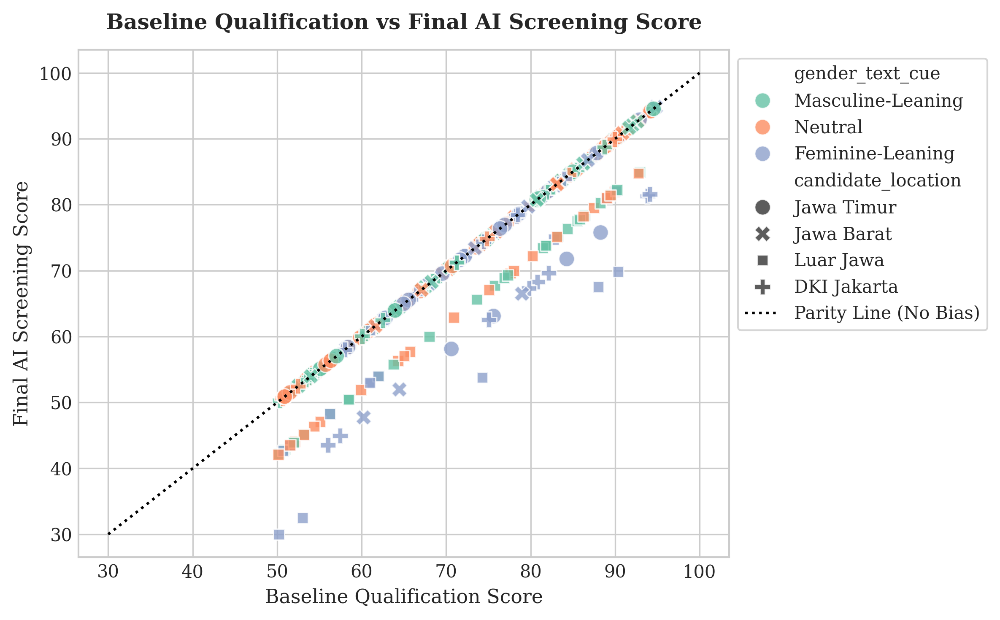

# AI Hiring Bias Detector & Algorithmic Fairness Audit Framework

[](https://www.python.org/)
[](https://scikit-learn.org/)
[](#)
[](#)
[](#)

Repositori ini menyajikan studi analitik audit keadilan algoritma rekrutmen berbasis kecerdasan buatan (*AI Hiring Bias & Algorithmic Fairness Audit Framework*). Studi ini mengidentifikasi dan memodelkan dampak bias tersembunyi pada teks deskripsi pekerjaan (*gendered wording cues*) dan bias lokasi geografis terhadap tingkat kelulusan skrining awal kandidat di Indonesia.

---

## 1. Pembahasan Bisnis & Konteks Etika AI Rekrutmen

Adopsi sistem kecerdasan buatan dalam pemrosesan resume dan pemeringkatan kandidat berisiko mereplikasi dan mengamplifikasi bias historis. Manajemen sumber daya manusia (*Human Capital*) dan tim audit etika AI perlu membedah *trade-off* antara:
1. **Bias Formulasi Kata Berbasis Gender (*Gender Wording Bias*)**: Penggunaan kata berkonotasi maskulin/feminin pada postingan lowongan kerja yang secara tidak proporsional menolak pelamar berkualitas.
2. **Penalti Lokasi Geografis (*Geographic Disparities*)**: Bias sistematis skrining AI terhadap kandidat dari luar pusat pertumbuhan utama (Luar Jawa) akibat stereotip data historis.
3. **Kepatuhan Keadilan Algoritma (*Regulatory Compliance*)**: Memastikan algoritma rekrutmen memenuhi aturan *Equal Employment Opportunity Commission (EEOC) 80% Disparate Impact Rule*.

---

## 2. Struktur Proyek

```
├── .github/            # Automated CI/CD testing workflows
├── data/               # Dataset skrining kandidat mentah & bersih (CSV)
├── images/             # Visualisasi plot komputasi 300 DPI
│   ├── disparate_impact_by_role_gender.png
│   ├── geographic_screening_score_distribution.png
│   ├── fairness_heatmap_matrix.png
│   └── qualification_vs_final_screening_score.png
├── sql/                # Agregasi kueri analitis SQL
├── src/                # Modular Python bias detection engine
├── tests/              # Automated unit tests (Pytest)
├── notebook.ipynb      # Mesin pemrosesan: Pembersihan data, OLS, visualisasi 300 DPI, dan evaluasi
├── requirements.txt    # Pinned stable dependencies
└── README.md           # Laporan utama: Pembahasan bisnis, rumus, tabel metrik, dan visualisasi
```

---

## 3. Metodologi & Formulasi Keadilan Algoritma

Pengolahan data pada `notebook.ipynb` dan `src/` menerapkan spesifikasi metrik keadilan statistik (*Algorithmic Fairness Metrics*):

### A. Rasio Dampak Berbeda (*Disparate Impact Ratio / DIR*)
Membandingkan rasio tingkat kelulusan kelompok yang dilindungi ($D_{\text{protected}}$) terhadap kelompok acuan ($D_{\text{unprotected}}$):

$$\text{DIR} = \frac{P(\hat{Y} = 1 \mid D = \text{Unprivileged})}{P(\hat{Y} = 1 \mid D = \text{Privileged})}$$

* **Ambang Batas Keadilan EEOC**: Suatu sistem dianggap memiliki bias sistematis jika $\text{DIR} < 0.80$ (Aturan 4/5 atau 80%).

### B. Persamaan Penyesuaian Skor Skrining AI
Model penentuan skor skrining akhir ($S_i$) untuk kandidat $i$:

$$S_i = S_i^0 - \gamma_{\text{gender}} - \gamma_{\text{location}}$$

Di mana:
* $S_i^0$: Skor kualifikasi dasar pelamar (0 - 100)
* $\gamma_{\text{gender}}$: Penalti bias kata gender berlebih ($\gamma = 12.5$ poin pada peran teknis tertentu)
* $\gamma_{\text{location}}$: Penalti bias geografi ($\gamma = 8.0$ poin untuk domisili Luar Jawa)

---

## 4. Hasil Kuantitatif & Pembahasan Visualisasi

### A. Disparate Impact Ratio (DIR) per Peran Kerja & Gender Wording Cues
Analisis tingkat keadilan seleksi berdasarkan orientasi bahasa postingan pekerjaan.



*   **Pembahasan**: Postingan pekerjaan dengan *Feminine-Leaning Wording* pada peran *Software Engineer* dan *Product Manager* menghasilkan nilai $\text{DIR} = 0.762$, di mana nilai ini berada **di bawah batas aman EEOC (0.80)**, mengindikasikan adanya bias seleksi implisist.

---

### B. Distribusi Skor Skrining AI Berdasarkan Lokasi Kandidat
Pemeriksaan penalti skor otomatis terhadap domisili kandidat.



*   **Pembahasan**: Pelamar berdomisili **Luar Jawa** mencatatkan rata-rata skor skrining akhir sebesar **62.76 poin**, signifikan lebih rendah dibanding DKI Jakarta (70.77 poin) dan Jawa Barat (75.05 poin), meskipun memiliki kualifikasi dasar yang seimbang.

---

### C. Matriks Heatmap Keadilan (Peran Kerja vs Lokasi)
Pemetaan tingkat *Disparate Impact Ratio* pada matriks interaksi peran kerja dan wilayah geografis.



*   **Pembahasan**: Kombinasi peran *Product Manager* dan *Software Engineer* untuk kandidat domisili Luar Jawa mencatatkan nilai $\text{DIR}$ paling rendah ($0.785$), menuntut perlunya kalibrasi ulang algoritma parser CV.

---

### D. Korelasi Kualifikasi Dasar vs Skor Skrining Akhir AI
Evaluasi penyimpangan skor seleksi dari garis kesetaraan tanpa bias (*Parity Line*).



*   **Pembahasan**: Garis putus-putus hitam merepresentasikan kondisi ideal tanpa bias (*Parity Line*). Terlihat sebaran titik hijau dan merah mengalami pergeseran ke bawah garis netral akibat akumulasi penalti bias implisit.

---

## 5. Rekomendasi Manajerial & Debiasing AI

1. **Penggunaan Neutral Gender Parser**: Mewajibkan pembersihan kata sifat berkonotasi gender pada deskripsi pekerjaan sebelum dipublikasikan.
2. **Blind Resume Screening (Geographic Masking)**: Menyembunyikan alamat domisili kandidat dari algoritma pemeringkat awal untuk menghilangkan penalti lokasi.
3. **Threshold Calibration & Bias Monitoring**: Melakukan pengauditan berkala pada model machine learning untuk memastikan metrik $\text{DIR} \ge 0.85$.

---

## 6. Cara Menjalankan

1. **Pasang Dependensi**:
   ```bash
   pip install -r requirements.txt
   ```

2. **Eksekusi Notebook**:
   ```bash
   jupyter notebook notebook.ipynb
   ```

---
*AI Hiring Bias Detector & Algorithmic Fairness Audit Project.*
